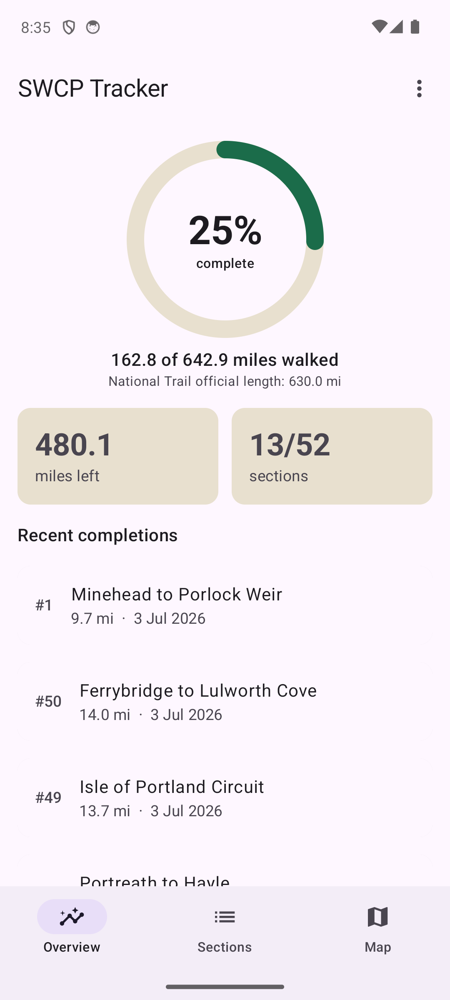
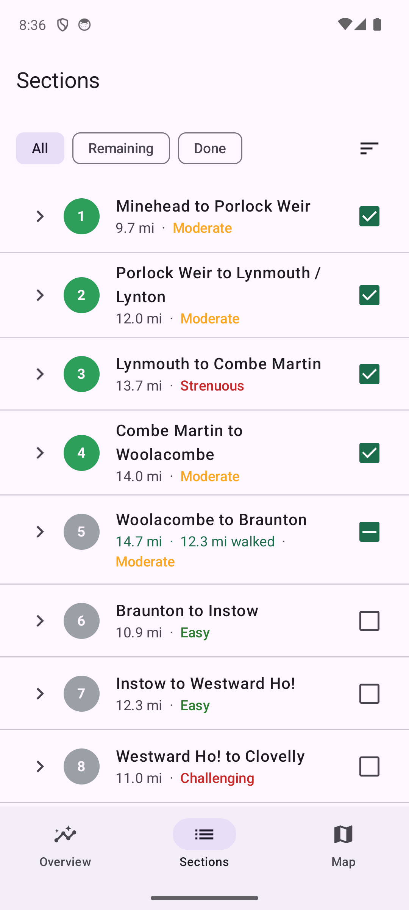
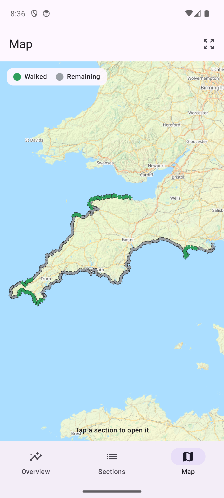
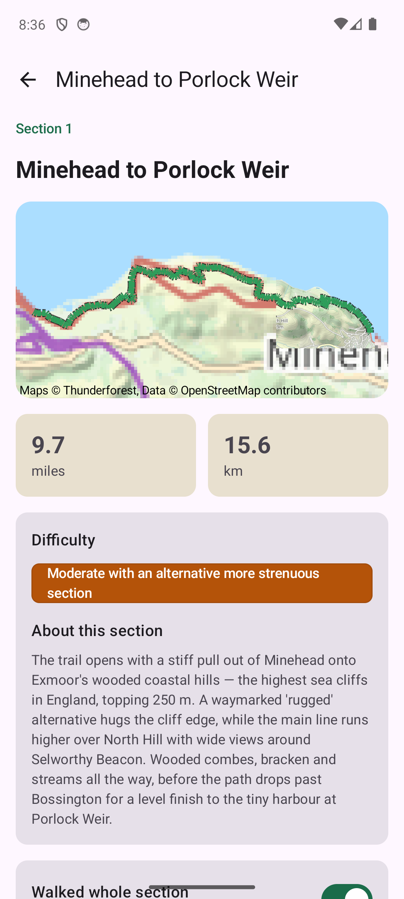

# SWCP Tracker

A free Android app for tracking your progress walking the **South West Coast
Path** — the 630-mile National Trail from Minehead to South Haven Point.

**Website:** https://tezzdubb.github.io/swcp-tracker/ ·
**Privacy policy:** https://tezzdubb.github.io/swcp-tracker/privacy.html

> Coming soon to Google Play (closed testing first). If you'd like to be one
> of the early testers, open an issue on this repo or get in touch via my
> profile.

## What it does

- **Progress at a glance** — a progress ring with miles walked, miles
  remaining and sections completed (n/52)
- **All 52 official sections** — tick them off whole, or log partial walks
  stretch-by-stretch between villages; finishing every stretch completes the
  section automatically
- **Interactive map** — the whole trail drawn over outdoor maps, walked
  stretches in green, remaining in grey; viewed areas are cached and work
  offline out on the path. It's locked to the coast (no scrolling off to
  Birmingham), with a one-tap button to reset the view
- **Walking journal** — every section has a route description, difficulty,
  a date-walked picker and timestamped notes with photos
- **Backup & restore** — export everything to a single JSON file

## Private by design

No accounts, no ads, no analytics, no tracking. Your walking history, notes
and photos stay on your phone unless you export them yourself.

| Overview | Sections | Map | Section detail |
|---|---|---|---|
|  |  |  |  |

## Support

The app is free and will stay free. If it's useful on your walk, you can
[buy me a coffee on Ko-fi](https://ko-fi.com/tezzdubb) — and if you love the
path itself, please support the
[South West Coast Path Association](https://southwestcoastpath.my.salesforce-sites.com/donate/EveryMileMatters),
the charity that keeps the trail walkable.

---

*SWCP Tracker is an unofficial, independent app, not affiliated with or
endorsed by the South West Coast Path Association or National Trails. It's a
progress log, not a navigation tool — carry a proper map and check tides,
ferries and firing-range times.*

*Maps © [Thunderforest](https://www.thunderforest.com/) · Route data ©
[OpenStreetMap contributors](https://www.openstreetmap.org/copyright) (ODbL).*
